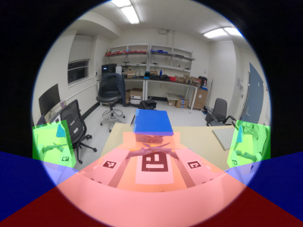

# Creative Tool Use
Robot imitation learning for one degree of freedom creative tool use


---

## Overview
This project explores **creative tool use in robotics**. Specifically, a robot arm was trained to both **position and cut a food item** using a pair of scissors mounted on a **custom end effector**. Traditionally, a robot must reposition the object using a pick and place tool before switching to a cutting tool, increasing task complexity and time.

Here, the robot instead uses the scissors themselves as a **multi-purpose tool**:
- **Positioning:** Move and align the food item when it is not in an ideal cutting location, **guiding with both scissor blades**
- **Cutting:** Execute the final slicing motion once aligned

This approach removes the need for an end effector swap, improving **efficiency**, **robustness**, and **task generality**.

A **state machine framework (SMF)** organizes the pipeline into modular subtasks. Two custom **YOLO classification models** verify completion of each subtask. If a failure is detected, the SMF automatically revisits prior subtasks to recover and continue the workflow.

---

## Project Phases

Development proceeded through multiple exploratory phases. You can find details about each phase in the linked READMEs below.

### Initial Exploration


[View README](./initial_exploration/README.md)

### Pick and Place


[View README](./pick_and_place/README.md)

### Final Deployment (pause between subtasks)


[View README](./final_deployment/README.md)

---

## Deploying the Pipeline

### Hardware Requirements

* **SO-101 Leader and Follower Arms**
  [https://huggingface.co/docs/lerobot/so101](https://huggingface.co/docs/lerobot/so101)

  * Two cameras: one mounted across from the follower arm, one to the left
* **Custom End Effector**
  (CAD files located in the root `/CAD` directory)
* **Scissors**
  [https://www.amazon.com/dp/B000UVMNF4](https://www.amazon.com/dp/B000UVMNF4)
* **Small Cutting Board**
  [https://www.amazon.com/KitchenAid-Classic-Nonslip-Plastic-11x14-Inch/dp/B09118Y7HX/ref=sr_1_18?sr=8-18](https://www.amazon.com/KitchenAid-Classic-Nonslip-Plastic-11x14-Inch/dp/B09118Y7HX/ref=sr_1_18?sr=8-18)
* **Cheetos®** (for the cutting task)

### Software Requirements

* **LeRobot v0.1**
  [https://huggingface.co/docs/lerobot/installation](https://huggingface.co/docs/lerobot/installation)
  - v0.1 code included already in creative-tool-use repository
* **Ubuntu 22.04**
* **Python 3.10**

---

## Running the Pipeline

To launch the state machine controller (Note that there are separate conda environments for lerobot and YOLO classification):
- For lerobot environment, follow instructions on above linked installation page
- For YOLO classification environment, only ultralytics package is needed
  - Separate environments created in order to prevent dependency issues

```bash
python3 main.py
```