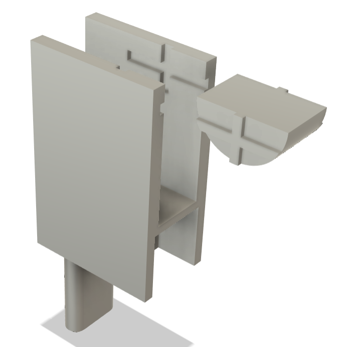

# Initial Exploration

## Overview

The initial phase of this project focused on experimenting with creative tool use on a **Franka Research 3 robot arm**. The goal during this stage was to explore whether a robot could operate a **one degree of freedom tool (scissors, pliers, can opener)** as part of a larger imitation-learning pipeline.

This work laid the foundation for later phases involving the SO-101 robot arm and full task deployment.

---

## Custom End Effector Development

To enable the Franka 3 to operate scissors, I designed a **modified snap-click end effector** that securely mounted a standard pair of scissors to the robot wrist. Early prototypes also included an optional pliers and can opener attachment for additional experimentation.

| Pliers | Can Top Opener |
|------------------|-----------------------------|
|  |  |

Key steps included:

- Designing a 3D-printed mount that aligned with Franka's wrist connector  
- Ensuring stable gripping geometry for the scissor handles  
- Allowing the arm to open/close the scissors using its finger motion  

---

## Data Collection

During this phase, I collected demonstration data using a modified [**Stanford UMI gripper**](https://umi-gripper.github.io/):

<table>
  <tr>
    <th>Masks (Before and After)</th>
    <th>Colored Mask Over Scissors</th>
  </tr>
  <tr>
    <td align="center">
      
    </td>
    <td align="center">
      
    </td>
  </tr>
</table>

Because the scissors extended beyond the UMI gripper’s default field of view, I **extended the UMI image mask** to include the full length of the scissors.

---

## Challenges Encountered

This phase surfaced several constraints that influenced later design decisions:

- **Outdated / deprecated Franka control software** caused compatibility issues with newer hardware  
- Image-mask adjustments were required to correctly capture the longer tool
- Progress slowed as the software stack diverged from current libraries, pushing the project toward using to a new platform (SO-101 arm)

Despite these limitations, the exploration validated the feasibility of using scissors and provided the foundational insight needed to proceed to the pick and place and final deployment phases.
