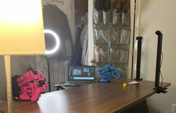

# Pick and Place Exploration

## Overview

After completing the initial exploration phase on the Franka 3 platform, the project shifted to a new manipulation system: the **LeRobot SO-101 leader–follower arm setup**. This phase focused on building a simple **pick and place** imitation learning pipeline trained entirely from **human demonstrations** using the leader arm to teleoperate the follower arm in real time.

This stage revealed key challenges in data quality, camera configuration, and repeatability that influenced several system updates.

---

## Transition to LeRobot + SO-101

To deploy imitation learning the workflow transitioned fully into the **LeRobot ecosystem** using:

- **SO-101 leader–follower teleoperation**
- **Action Chunking Transformer (ACT)** for policy learning
- Synchronized multi-camera observations

---

## Initial Attempt: Failed Pick and Place

In the first iteration of the task, the robot was trained to:

1. Pick up a colored block  
2. Place it onto an index card

However, the model consistently failed to grasp the block. Instead, the follower arm repeatedly executed a trajectory that hovered *slightly above* the block, never actually contacting or lifting it. This failure highlighted that the demonstrations did not sufficiently represent accurate grasp pose alignment and that several elements of the capture environment required correction.

Through these trials, several critical issues were identified:

### **Required Changes in Demonstration Setup**

- **Camera placement:** Needed more overhead visibility and less task occlusion  
- **Reduction of camera shake:** Stabilized mount away from moving parts to prevent motion blur  
- **Lighting improvements:** Removed glare, reduced shadows, and ensured uniform illumination  
- **More episodes:** Increased dataset size to improve generalization  
- **Less variation:** Reduced positional randomness to help the model converge  
- **High-contrast objects:** Switched to colors easily segmentable by the cameras  

These findings motivated a fully revised data collection setup.

---

## Revised Environment

A sterile, highly controlled environment was created to improve demonstration quality:

- Overhead camera angle adjusted  
- Lighting locations selected to prevent reflective desk background  
- Controlled lighting to minimize shadows  
- Consistent block orientation and placement  

This environment dramatically improved the clarity of the recorded demonstrations.

---

## Overfit Model Success

With the improved setup, an **intentionally overfit ACT model** was trained on demonstrations collected from **the exact same pick and place location** with minimal variation.

This resulted in a consistently successful pick and place execution, but **only** when starting from the same configuration as in the demonstrations. Generalization to new orientations or positions remained unreliable.

While limited, this success demonstrated that:

- The imitation-learning pipeline itself was functional  
- The SO-101 could reproduce teleoperated motions accurately  
- Data quality was the primary bottleneck, not the model architecture

---

## Evaluation and Final Observations

Toward the end of this phase, a test run showed the robot **missing the block several times**, then eventually correcting and completing the task. These repeated failures were traced to a **robot arm recalibration issue**, which caused slight errors in the follower arm’s pose execution. Despite this, the pipeline still managed to complete the task, demonstrating:

- Robustness of the leader–follower teleoperation demo data  
- Partial resilience of the ACT policy to minor pose offsets  
- Viability of the SO-101 + LeRobot workflow for future multi-step tasks

---

## Summary

This phase established the foundation for future tool-use learning by:

- Validating the SO-101 for imitation-learning experiments  
- Identifying critical improvements to the camera/lighting/data pipeline  
- Demonstrating successful (though overfit) policy execution  
- Revealing stability issues that influenced later design choices

With these lessons learned, the project transitioned into training and deploying the **creative scissors-based tool use pipeline**.

